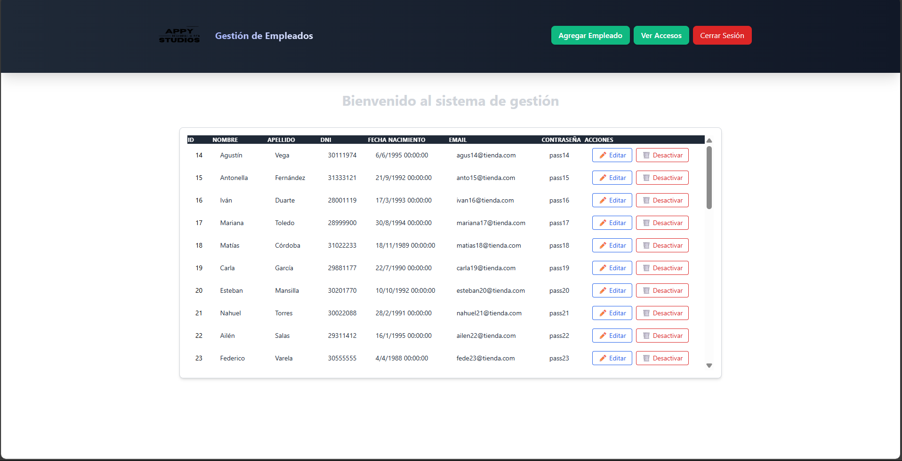
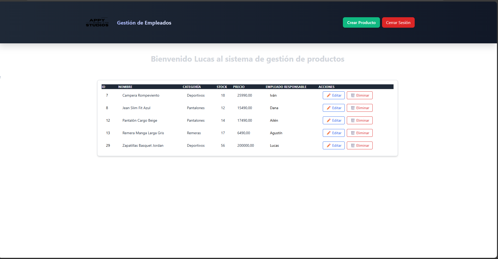
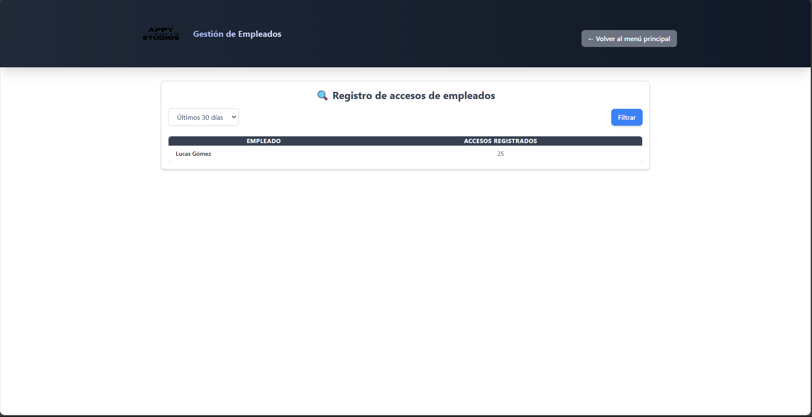

# 🧑‍💼 Sistema de Gestión de Empleados

Este proyecto es una aplicación web desarrollada en **ASP.NET Web Forms (C#)** como parte del trayecto académico de **la Tecnicatura Universitaria en Programación (UTN)**. Su objetivo es servir como una práctica completa de arquitectura modular, gestión de usuarios, y control de accesos, enfocada en conceptos clave como la separación de roles, manejo de sesiones y diseño orientado a objetos.

> 🧠 Proyecto con fines educativos. No está destinado a entornos productivos.  
> 👨‍💻 Autores: 
-Lázaro Abecia
-Kevin Yáñez
-Benjamín Veyries
-Mariano Young 
> 🎓 Carrera: Tecnicatura Universitaria en Programación – UTN  
> 📚 Materia: Programación II (Proyecto del 2do Parcial)

---

## 🔧 Tecnologías Utilizadas

🔧 Tecnologías Utilizadas (actualizado)
- ASP.NET Web Forms (C#)
- SQL Server (con procedimientos básicos de SELECT, INSERT, DELETE)
- Tailwind CSS para el diseño responsive
- Navegación modular controlada por sesión con lógica basada en VistaActual
- Arquitectura organizada por capas: modelos, controladores, y helpers reutilizables
- Manejo de sesiones tipadas y múltiples roles (Admin / Empleado)


---

## 🎯 Funcionalidades Principales

### 🔐 Autenticación
- Inicio de sesión para administradores y empleados
- Validación de credenciales desde base de datos
- Redirección automática según el rol logueado

### 🧑‍💼 Gestión de Empleados
- Listado y edición de empleados activos
- Desactivación lógica en lugar de eliminación física para preservar integridad referencial
- Transferencia de productos previa a la desactivación: el sistema solicita seleccionar a otro empleado responsable antes de desactivar a uno que tenga productos asignados
- Esta lógica evita conflictos con accesos registrados y asegura que ningún producto quede sin responsable
- Visualización clara de los empleados activos en la interfaz principal
- (En versiones futuras podrías incluir un módulo para mostrar/gestionar empleados inactivos)


### 📦 Gestión de Productos
- ABM de productos asociados a empleados responsables
- Carga dinámica de los módulos desde el menú principal

### 📊 Control de Accesos
- Historial de logins por empleado, con visualización filtrada por fechas
- Integridad asegurada: los empleados no pueden ser eliminados si tienen accesos registrados
- Futuro: se podrá mostrar también la hora exacta de ingreso y egreso, junto con la duración de cada sesión
✅ A partir de la integración del control de accesos, se modificó la lógica original para reemplazar la eliminación de empleados por una desactivación lógica. Esta práctica evita perder historial, mantiene la trazabilidad completa y permite restaurar o consultar registros históricos sin afectar la estructura de datos.

### 🔁 Navegación Dinámica
- Módulos cargados según estado de sesión
- Vista mantenida con `Session["VistaActual"]`
- Evita errores de postbacks huérfanos

---

## ⚙️ Cómo Ejecutarlo

### 1. Prerrequisitos

- Visual Studio 2019 o superior
- SQL Server (Express o Management Studio)
- Configuración de IIS Express o hosting local habilitado
- Tailwind incluido vía CDN en los archivos `.ascx`

### 2. Configuración Inicial

- Crear base de datos: `SistemaGestionEmpleadosDB`
- Ejecutar los scripts `.sql` para generar las tablas:
  - `Empleados`
  - `Administradores`
  - `Productos` *(con `EmpleadoResponsableId` como FK)*
  - `Accesos`

- Configurar la cadena de conexión en `Web.config`:

```xml
<connectionStrings>
  <add name="ConexionBD" connectionString="Data Source=.;Initial Catalog=SistemaGestionEmpleadosDB;Integrated Security=True" />
</connectionStrings>
```

3. Compilación y ejecución
- Abrir el proyecto en Visual Studio
- Establecer Default.aspx como página de inicio
- Ejecutar con IIS Express (F5)

📁 Estructura del Proyecto
```xml
/SistemaGestionEmpleadosWebForm
│
│
├── Controllers/
│     ├── AdminController.cs
│     ├── EmpleadoController.cs
│     └── ProductoController.cs
│   
├──Helpers/
│   ├── AdminSessionHelper.cs
│   ├── NavegacionHelper.cs
│   ├── SessionHelper.cs
│   └── VistaActual.cs
│   
├── Models/
│    ├── Administrador.cs
│    ├── Empleado.cs
│    ├── Producto.cs
│    ├── IngresoEmpleado.cs
│    ├── RegistroAccesoEmpleado.cs
│    ├── ConexionDB.cs
│    └── app.config
├── App_Code
├── UserControls/
│   ├── Login.ascx
│   ├── uc_MenuPrincipal.ascx
│   ├── uc_ControlDeAccesos.ascx
│   └── MenuEmpleado.ascx
│   
│
├── App_Data/
├── Content/           ← recursos de estilo o utilitarios visuales (si los usás)
├── img/               ← logos, íconos o imágenes auxiliares
├── Pages/             ← futuras extensiones si tenés páginas adicionales
├── Default.aspx       ← punto de entrada del sistema
└── Web.config         ← configuración general, cadena de conexión, autenticación
```

💡 Funcionalidades destacadas
- ✔️ Uso de Eval y Bind en GridView para edición controlada y diseño responsivo con Tailwind
- ✔️ Transferencia automática de productos a otro empleado antes de desactivarlo, preservando integridad y relaciones
- ✔️ Desactivación lógica en lugar de eliminación física, manteniendo el historial de accesos y evitando conflictos de claves foráneas
- ✔️ Arquitectura desacoplada con separación entre modelos, lógica de negocio y presentación
- ✔️ Programación orientada a objetos con controladores reutilizables, propiedades calculadas y helpers modulares
- ✔️ Gestión de vistas y navegación dinámica basada en VistaActual y SesionHelper, sin necesidad de recargar controles dinámicos


🙋‍♂️ Contribuciones
Este proyecto está pensado como ejercicio grupal/académico. Si algún compañero/a desea adaptarlo para su propio aprendizaje o práctica, puede hacerlo libremente con fines no comerciales.


📌 Notas finales
- Este proyecto puede ampliarse fácilmente para incluir:
- Gestión de permisos por acción
- Exportación a Excel/PDF
- Autenticación con tokens o JWT
- Fue realizado aplicando buenas prácticas aprendidas durante la carrera
- Las imágenes, íconos y estructuras visuales se generaron con ayuda de Tailwind CSS

 
 
 
 
